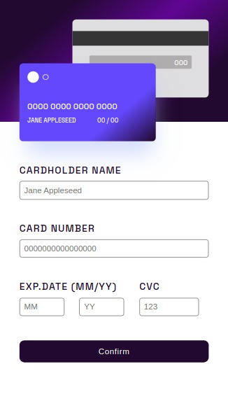
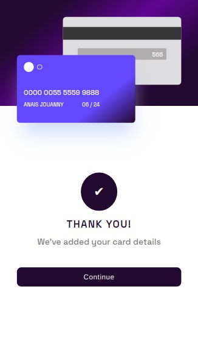
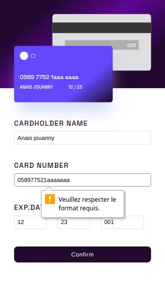
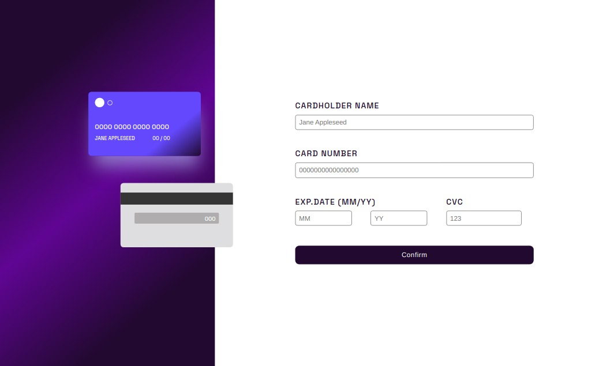

## Objectifs

M'exercer sur plusieurs techniques du développement Frontend :

- React (structure d'une application en composants, gestion d'un state, JSX)
- CSS (flexbox vs grid / dégradés / media queries)
- SASS (utilisation de variables simples)
- HTML5 (contraintes de validation des inputs d'un formulaire)

## Outils

- HTML5
- Mobile-first workflow
- Flexbox et CSS Grid
- SASS
- React
- J'ai choisi de ne pas utiliser de State centralisé au vue de la taille du projet

## Brief

Les utilisateurs doivent être en mesure de :

- Remplir le formulaire et voir les détails de la carte se mettre à jour en temps réel
- Recevoir des messages d'erreur lorsque le formulaire est soumis si :
  - un champ de saisie est vide
  - les champs numéro de carte, date d'expiration ou CVC ne sont pas au bon format.
- Afficher la mise en page optimale en fonction de la taille d'écran de leur appareil
- Accéder à une page de confirmation

# Screenshots

